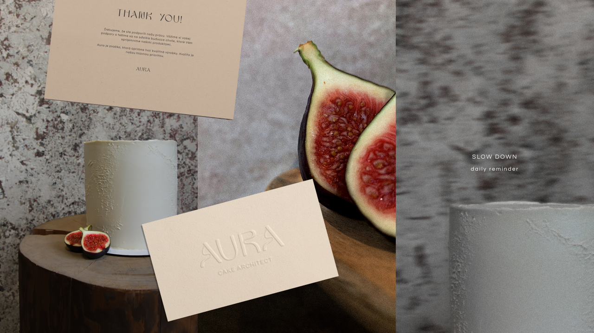

# First Impression

<!-- This is a comment, only visible to the author: Add a link to your presentation. -->
<!-- Presentations do not need to be a PDF, you may link elsewhere, such as Figma, YouTube, etc. -->
<!-- Consider adding navigation to each section (About, Featured Projects, Notes, etc.) -->

<!-- - [View Presentation](img/surname-draft-first-impression-2023.pdf)-->
- [About](#about)
- [Featured Projects](#featured-projects)
<!-- - [Notes](#notes) -->

## About

<!-- Consider including a headshot. We’re not designing, so keep the image width/height around 320px x 320px (square). Replace "surname" with your surname in the file name. -->

<!---->

_Hello, I’m Klára,_
_junior digital (UX/UI) and graphic designer, striving to make the world a less complicated place. I'm currently commuting between Banská Bystrica (SK) and Prague (CZ), open to remote work and hitting the mountain trails._

## Featured Projects

My visuals always derive from clients needs, therefore they differ. <!-- I don't have a specific style. --> For the following presentation I chose three projects from entirely different areas. For my work, I like to choose projects that are, in my eyes, meaningful. I tend to choose topics <!-- connected to --> of mental health, physical health, education or culture.

### Rheumatic Diseases with Chill (Revma v klidu) / 2023

<!-- Use a static poster image or animated GIF, but no video files. Again, keep the image width/height manageable, around 1280x x 720px (16:9 aspect ratio), or a max-width of 1280px. -->

- *Online educational and motivational course for people with revmatic diseases. It is being created by Česko.digital (Czech.digital), volunteer community of profesionals*.
- *The aim of the project is to spread awareness of the disease and to motivate patients to physical exercise at home. It will help people, who can't afford exercising with professional assistence in a long-term. This project is one of its kind in Czech Republic*.
- *I gained the experience of in-depth user interviews and user testing, worked in a crosss-field team and once again found my sence for the tiniest detail. I became a part of the Česko.digital community, as well*.

### Aura Cake Architect / 2023

<!-- Use a static poster image or animated GIF, but no video files. Again, keep the image width/height manageable, around 1280x x 720px (16:9 aspect ratio), or a max-width of 1280px. -->

- *Visual identity for a pattiserie*.
- *The task was to create an identity for the pattiserie and make it a brand, so it will stand out from the other pattiseries in town. The main idea I created and want to be communicated, is to be more present. Aura shouldn't be just about desserts but also about slowing down. About mindufully enjoying the dessert and the moment itself*.
- *Aura is a small business, so the branding was all on me. And I creatd it from scratch. Besides the visual identity, I came up with a list of potential names, I provided my client with a competition research, but I also took care of photos and copywriting.*

### Czech School Without Borders, London / 2022

<!-- Use a static poster image or animated GIF, but no video files. Again, keep the image width/height manageable, around 1280x x 720px (16:9 aspect ratio), or a max-width of 1280px. -->

- *Visual identity for Czech School in London. School project for a real client*.
- *The school was facing a problem of categorising their activities in online and offline communication. Our goal was to distinguish the areas and make the communication understandable*.
- *We (me and my classmate) solved their problem of categorising activities. We came up with symbols representing four pillars of the school: education, extracurricular activities, special events and volunteering. The client chose our indetity and the collaboration continued. I also realized the importance of working in a team. I was lucky to find a like-minded colleague in my classmate and our work collaboration continues*.

<!-- ### Featured Project Title 1 -->

<!-- Use a static poster image or animated GIF, but no video files. Again, keep the image width/height manageable, around 1280x x 720px (16:9 aspect ratio), or a max-width of 1280px. -->

<!--

<!-- - A short description about the project — *the what*.
- A short description about the significance of the project — *the whys*.
- A short description about the outcome of the project — *the result or takeaway*. -->

<!-- ## Notes 
-->
<!-- Numbered comments about each featured project as presenter notes or speaking points. -->

<!-- 1. …
2. …
3. …
And so on. -->
