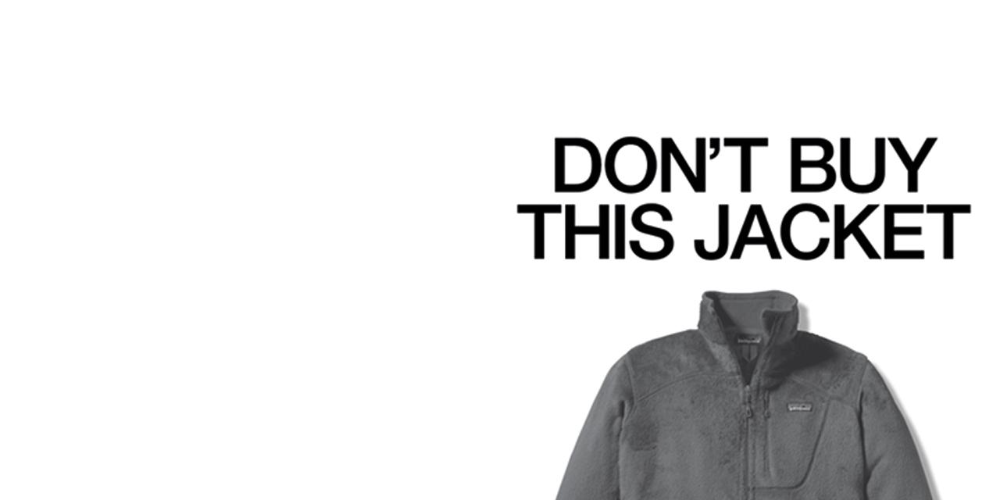

# Voice, Tone, and Style of Patagonia brand

<!-- Voice, Tone, and Style -->
<!-- Voice and Tone (Style, too) -->
<!-- Content Style Guide -->
<!-- Note: Even your headings can have your voice, tone, and style. -->

Patagonia continually reinforces itself as a brand rooted in transparency in each of its communication channels. And by creating a brand voice that is trustworthy and educational, the customer is led on a consistent brand journey.

### Dimensions

>Funny <> **(+1) Serious**
>
>**Casual (+1)** <> Formal
>
>Irreverent <> **(+2) Respectful**
>
>Enthusiastic <> **(+1) Matter of Fact**

– [Patagonia Branding Strategy and Marketing Case Study](https://mapandfire.com/branding-strategies/patagonia/)

<!-- Example:

> **Join our community**
> 
> Sign up for product highlights, original stories, activism awareness, events and more.

Call to join the newsletter is serious but casual. -->

## Voice

Message consistency in all marketing channels creates the environment for clients to trust an impact-driven company.

– [What is it about Patagonia](https://medium.com/@amylipner/what-is-it-about-patagonia-306999f2f986)

- **Transparent, but thoughtfully:** Patagonia makes a big deal about transparency. From supply chain to cash register, Patagonia presents as upfront, honest, and accountable. Patagonia is definitely not shying away from their earth-friendly mission. It’s all over. But they know when and how to deploy information about their mission without overwhelming the customer. They create spaces for customers at every level of engagement, without letting people off the hook.
   
- **Trustworthy:** The high level of transparency leaves no space for doubt about trusting the brand. Their mission to reduce harm to the environment and to help rebuild it is clear and well communicated. What resonates with Patagonia customers is that the company doesn’t just talk the environmental talk. Its founder Yvon Chouinard, an accomplished rock climber, also backs up the company’s talk with its actions.
   
   – [The Success of Patagonia's Marketing Strategy](https://www.investopedia.com/articles/personal-finance/070715/success-patagonias-marketing-strategy.asp)
   
- **Educational**

  > **End bottom trawling**
  >
  > Bottom trawling is bulldozing our ocean floor, undermining small-scale fisheries, and deepening the climate crisis. Let's end this destructive practice, starting with an immediate ban on bottom trawling in Marine Protected Areas and inshore zones. **Sign the petition.**
  
  > There are 65,000 inefficient, habitat-destroying, CO2-spewing deadbeat dams in the United States. They are decimating our wild salmon and steelhead. It’s time to retire deadbeat dams. 

## Tone

> Functional, comfortable climbing gear built to move and made to last.

<!-- Here is an email introducing a new line of work apparel:
> We set out to build a Workwear line — jackets, pants, sweaters, shirts and hats — that is more durable and uses less harmful materials. Our design process begins with the basic elements — innovative hemp blends or warm, superdurable synthetics — and from there we add exactly what is necessary for the specific end use.

– [What is it about Patagonia](https://medium.com/@amylipner/what-is-it-about-patagonia-306999f2f986) -->

- **Direct:** The language and content is unfussy, matter-of-fact, always with some insight into the Patagonia design process.

examples from Instagram posts:

> Nothing replaces *wild*.
  
> Not Mars.
  
- **Respectful:** They don't push you to anything niether try to induce a sense of guilt.
  
- **Conversational:** On social media, they communicate more personally but still directly to the point without any fuss around.

> **Iceland needs you**
  >
> Add your voice to the movement. Open net salmon farms have no place in our wild waters. **Sign the petition.**

> Our warm, breathable active layers will keep you charging hard in cool to cold conditions. How you fine-tune your system with them is up to you.

## Style

Introduction to section…

<!-- Consider including style tips on capitalization of headings (sentence or title case), words to avoid, or general grammar and mechanics dos and don’ts, etc.
See: https://styleguide.mailchimp.com/grammar-and-mechanics/-->

- Without many adjectives or descriptions
- …
- …

