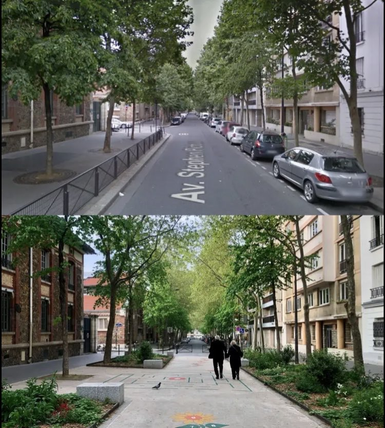

# Why Keeping Your Desk Tidy Matters

27 March 2024, Prague

Listen to the [story]()

Download the [video]() (audio+slides)

Download the [slides]()

See the [process](process.md)

Hello, I'm Klára. I'm in a bachelor's year of graphic design at University of Creative Communication in Prague.

### Perfect Not Cluttered Space

If I asked you to close your eyes and imagine your working desk at home. Is it tidied up? Everything lined up and in its place?

Or is it a total mess? Used tissues, unwashed plates and anything else you've used in the last three days?

When I work at my desk, I want as little stuff on it as possible. But it wasn’t always that way.

Ever since I was in elementary school, I wanted to do so many things. I wanted to ride a horse, to play a guitar, but I also liked mathematics, I wanted to dance, to do ceramics… I wanted to start manny hobbies and it often ended up with having many things unfinished.

Looking back on it like that, I must have been overwhelmed.

When I was at high school, I (again) took part in several extracurricular activities. I was a part of a school parliament and I helped to rebirth a school magazine. There I was the editor, the „graphic designer“ and sometimes even a poet. I loved all the planning, organising and mainly all the creating.

I was always busy. Always found myself something to do. Even when I was at home. Time spent just sitting on a couch didn’t exist for me. But I didn’t realise it, thus I didn’t mind it.

It all changed when I came to university. At the starting line of becoming a designer, I realised there are so many options. So many different paths I can take. It terrified me.

I kept overthinking my possible career. I saw the myriad options to choose from, many tools to learn. I started to doubt myself.
Am I able to do this? When am I going to learn all this? That’s so much new stuff.

My mind became cluttered with these thoughts.

As I started university, I also moved to Prague. My hometown is 540 km aways, so daily commuting wasn’t an option, haha.

So, as I was attending classes with that cluttered mind, I realised it’s not only my mind.

It was the full timetable. It was the crowded subway travel. It was the loud roads with constantly flowing cars. It was the gym without windows.

Prague was somehow too big and too loud for me.

Of course its not the Prague, this could be applied to any big city.

But all this city hustle was soaking my energy up.

When I was writing this talk, I did a little research. Just to support I’m not that weird. And here’s what I’ve found:

> **Urban living: 5 tips to manage mental health and city life**
> 
> **Why do big cities give me anxiety**
>
> **Big City Sensory Overstimulation**
>
> **How the City Changes Your Brain**
>
> **Are big cities bad for our mental health?**
>
> **City Sensory Overload Changes the Brain**
>
> **Why living in cities raises stress**
>
> **How Living in a City Can Mess with Your Mental Health**

I [found](https://www.healthline.com/health/mental-health/living-in-a-city#Constant-stimulation-from-city-living-can-take-a-big-toll-on-your-mental-health), that urbanites are 21 percent more likely to have anxiety disorders and 39 percent more likely to have mood disorders. What causes the unpleasant feelings to many people are the crowds, pollution, noise, and even the so called visual smog. Our brains haven’t evolved to handle the overstimulation present on a city street.

In short, metropoles lack green and quiet.

In contrast to metropoles, the perfect *not cluttered space* would be the open-space. In other words — nature.

My enthusiasm for not cluttered spaces and actually the reason I decided to talk about this topic may have something to do with the region I come from. When you’d stand in the centre of our town, whichever direction you look everywhere the city ends, it meets a forest.

And, you know, when you go to that forest, there is no sign of a billboard.

Any wires, or excessive advertising.

Any crowds, or white lights of shopping malls.

Just green.

Fresh air and silence.

Nature is simply the greatest example of a „not cluttered“ space. I believe we should bring more of it into our urban areas. To incorporate it within the city surroundings and make our cities more pleasant to live in.

### Fridays for Future

The point when I became more aware of the public space was probably since I could vote. I started to care about politics. I learned about fast fashion industry — I found out what is a carbon footprint. And I became sensitive to events happening in the world.

Back in the 2019, when I was 18, I started to realise how important the nature and the wildlife is, but also how endangered it is. 

Teenagers, or actually young people in general tend to be more enthusiastic and eager to change the world. Some older people would say naive — I would say, we need more of that naivity then.

But anyways, in the time I was becoming more aware of the world itself, a student movement called Fridays for Future was becoming viral.
And it was pretty big. Actually, it was likely the largest climate protest in world history. There were over **2,500 events** scheduled in over **163 countries** on **all seven continents**.

> The Fridays For Future youth movement began in 2018, inspired by Greta Thunberg’s solitary protests outside the Swedish parliament. It reached a high point in November 2019, when 4 million people took part in 4,500 actions worldwide on one Friday.
>
> — [*The Guardian*](https://www.theguardian.com/environment/2022/sep/23/thousands-call-for-climate-reparations-and-justice-in-global-protests)

For those of you who haven’t heard about it, these were global school strikes organised by students. They were inspired by Swedish climate activist Greta Thunberg, age 16.

> Exploding global movement of teens specifically—sort of young people more generally—protesting in various ways, the inaction of the community of business people and political leaders in combating— what this generation sees as—the existential challenge of climate change.
>
> —[*Vox*](https://www.vox.com/energy-and-environment/2019/9/20/20875523/youth-climate-strike-fridays-future-photos-global)

The main demand of the protests was action to keep global warming under 1.5 degrees Celsius, in line with the 2015 Paris agreement.

Young people weren’t the only who was concerned about their future. Protests were supported by scientists, universities, academics, older generations and even global companies like Atlassian, The North Face, Patagonia, WordPress, SodaStream, Burton, Ben & Jerry’s and others.

And I, of course, decided to support it too. After our english teacher was willing to take us to one of these protests in our capital, we organised it in our town too. The main message for the attending people was to make them become aware of their behaviour.
To start noticing where does their food come from, where does their clothes come from. If they really need to put their fruits in  plastic bag. And if so, whether could their bring a reusable one.

The bigger picture was to appeal on our government. One of the demands was to stop the logging in national parks. Our country is rich in them, but if this logging in the fifth stage of protection continues, it won’t be so rich anymore.

So even though I am terrified of public speaking, I stood on the podium and I contributed my bit.
Because I do believe, preserving those not cluttered open spaces is crucial for us all. And I wanted to support it.

### Digital Space

But back to the cluttered spaces. Back to your (maybe) cluttered desk.

Now I want you to imagine your home-screen. Or your web browser.

Would it look like mine? 

If I open my Safari there will be 16 tabs open. And that would be just one of the windows. Than I would have another window with another 10 opened sites. And guess how many open tabs there will be in my mobile browser. 48.

Having many tabs open is one of the forms of digital clutter.

Seeing dozen of tabs open creates a sense of urgency and overwhelm. People who decluttered their digital space and created a habit of a single open tab felt calmer, more creative, and able to sustain deep attention for longer periods of time.

As I was used to have many activities and thought I have to be constantly productive, one day I found it’s hard for me to do nothing. To be bored. In moments of relax I kept feeling like I should do something after all.

I used to do so much that it was unnatural for me to do less.

And I see this in many young adults. Many of us constantly strive for perfection, success and praise. Often comparing ourselves to others. We are in era of fast changes and endless possibilities. But in the end it’s us, who puts pressure on ourselves.

But I also feel our generation is becoming aware of it. I think that we feel this fast era is unhealthy for us and we are returning to the slower life.

Nowadays I don’t say yes to every opportunity if I don’t feel like it. I am stopping trying to multitask. I am not punishing myself if not making everything I planned for the day. And I am planning less for the day.

Decluttering our both online and offline spaces can help us to live slower to a great extent. And last but not least, mainly staying outdoors. In the open space. In the nature space.

In a cluttered environment, it's easy to feel overwhelmed and stuck. But after cleaning it, you'll have more mental space to develop new ideas and solutions. And live happy, strong, and healthy life.

Thank you and remember to clean your desk.
