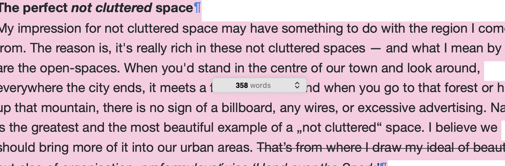
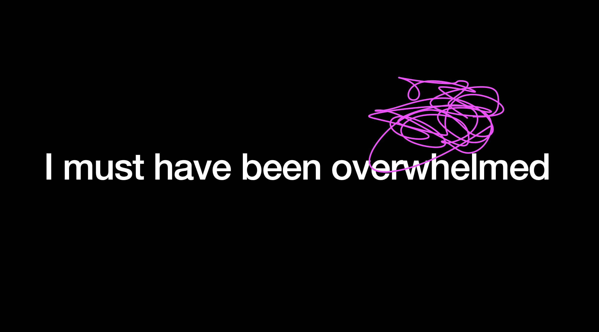

# Decluttering Your Space

by Klára Záskalanová

11 March 2024

— Read the [Article](index.md)

## Choosing a topic

At first I wrote down everything that came to my mind. What I care about. What I do, what I've done. 

## Thinking of the connections

After that I chose topics I felt could interconnect somehow. I put them on sticky notes and came up with covering name —— *Decluttering your space.*

## Writing

Then I had a little crisis because my word count wasn't sufficient. Even though I knew I had just started.

After I sat down and focused on the work for about two-three days, I finished the story. I did it at first try, even though I know I shouldn't do the creative and the correcting phase at one time... I elaborated on the subtopics and then tried to iinterconnect them. The connecting was the hradest part, but I think I did quite well.

## Slides

I read it through and started to work on the slides. They consisted mainly of sentences picked from the story. I wanted the audience to focus more on the words, than the slides. At the end, I added some hand drawn doodles to give the slides some color.

