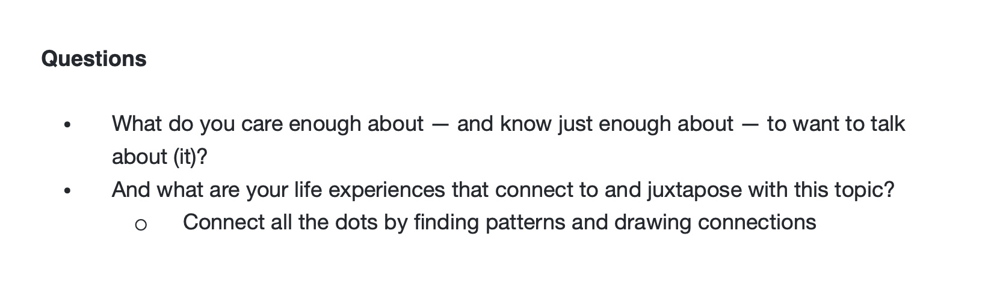
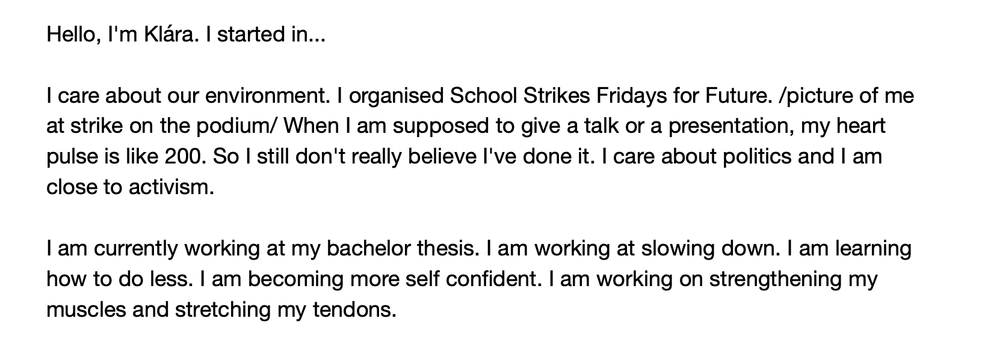

## Choosing a topic

At first I wrote down everything that came to my mind. What I care about. What I do, what I've done. 

After that I chose topics I felt could interconnect somehow. I put them on sticky notes and came up with covering name —— *Decluttering your space.*

