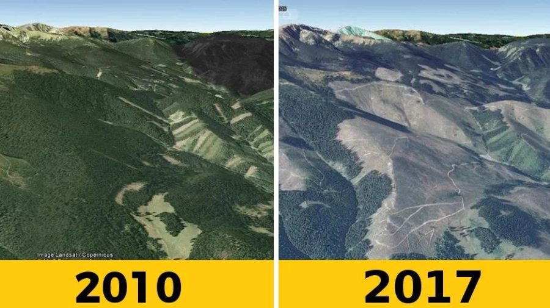
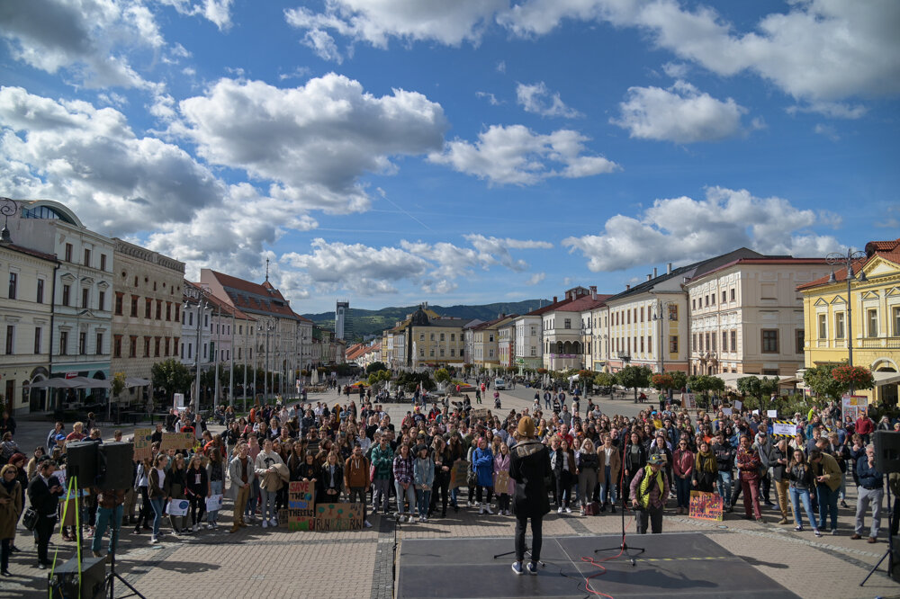

# Prečo na upratanom stole záleží

27 Marec 2024, Praha

Vypočujte si [príbeh]() //bude pridané

Stiahnite si [video]() (audio+prezentácia) // bude pridané

Stiahnite si [prezentáciu](assets/slides.pdf)

Pozrite si [proces](process.md)

Prečítajte si [anglickú verziu](index.md)

Dobrý deň, ja som Klára. Som v bakalárskom ročníku grafického dizajnu na Vysokej škole kreatívnej komunikácie v Prahe.

### Dokonale nezaprataný priestor

Ak by som vás požiadala, aby ste zavreli oči a predstavili si pracovný stôl, ktorý máte doma, bol by uprataný? Všetko zoradené a na svojom mieste?

Alebo je na ňom totálny neporiadok? Použité vreckovky, neumyté taniere a všetko ostatné, čo ste použili za posledné tri dni?

Keď pracujem pri svojom stole, chcem, aby na ňom bolo čo najmenej vecí. Ale nebolo to tak vždy.

Už od základnej školy som chcela robiť toľko vecí. Chcela som jazdiť na koni, hrať na gitare, ale bavila ma aj matematika, chcela som tancovať, robiť keramiku... Chcela som začať s mnohými koníčkami a často sa to skončilo tým, že som mala veľa vecí nedokončených.

Keď sa na to tak spätne pozerám, musela som byť preťažený.

Keď som bola na strednej škole, (opäť) som sa zúčastňovala na viacerých mimoškolských aktivitách. Bol som súčasťou školského parlamentu a pomáhal som znovuzrodiť školský časopis. Tam som bola redaktorkou, "grafičkou" a niekedy aj poetkou. Milovala som všetko to plánovanie, organizovanie a hlavne všetko to tvorenie.

Vždy som bola zaneprázdnená. Vždy som si našla niečo na prácu. Dokonca aj keď som bola doma. Čas strávený len sedením na gauči pre mňa neexistoval. Ale neuvedomovala som si to, a tak mi to nevadilo.

Všetko sa zmenilo, keď som prišla na univerzitu. Na štartovacej čiare stávania sa dizajnérom som si uvedomila, že existuje toľko možností. Toľko rôznych ciest, ktorými sa môžem vydať. Vydesilo ma to.

Stále som nad svojou možnou kariérou premýšľala. Videla som nespočetné možnosti, z ktorých som si mohla vybrať, množstvo nástrojov, ktoré som sa musela naučiť. Začala som o sebe pochybovať.
Som toho schopná? Kedy sa idem toto všetko naučiť? To je toľko nových vecí.

Moja myseľ sa zahltila týmito myšlienkami.

Keď som začal študovať na univerzite, presťahovala som sa do Prahy. Moje rodné mesto je vzdialené 540 km, takže každodenné dochádzanie neprichádzalo do úvahy, haha.

Takže keď som chodila na hodiny s tou zahltenou mysľou, uvedomila som si, že to nie je len moja myseľ.

Bol to plný rozvrh. Bolo to cestovanie preplneným metrom. Boli to hlučné cesty s neustále prúdiacimi autami. Bola to posilňovňa bez okien.

Praha bola pre mňa akosi príliš veľká a príliš hlučná.

Samozrejme to nie je iba Prahou, toto by sa dalo aplikovať na akékoľvek veľkomesto.

Ale všetok ten mestský ruch pohlcoval moju energiu.

Keď som písala tento príbeh, urobila som si malý prieskum. Len aby som sa utvrdila v tom, že nie som až tak divná. A tu je, čo som zistila:

> **Mestský život: 5 tipov, ako si udržať duševné zdravie a zvládnuť život v meste**
> 
> **Prečo mám z veľkých miest úzkosť**
>
> **Nadmerná zmyslová stymulácia vo veľkomeste**
>
> **Ako mesto mení váš mozog**
>
> **Škodia veľkomestá nášmu duševnému zdraviu?**
>
> **Mestské nadmerná stimulácia mení mozog**
>
> **Prečo život v mestách zvyšuje stres**
>
> **Ako môže život v meste narušiť vaše duševné zdravie**

[Našla som](https://www.healthline.com/health/mental-health/living-in-a-city#Constant-stimulation-from-city-living-can-take-a-big-toll-on-your-mental-health), že u obyvateľov miest je o 21 percent vyššia pravdepodobnosť výskytu úzkostných porúch a o 39 percent vyššia pravdepodobnosť výskytu porúch nálady. To, čo mnohým ľuďom spôsobuje nepríjemné pocity, sú davy ľudí, znečistenie, hluk a dokonca aj tzv. vizuálny smog. Naše mozgy sa nevyvinuli tak, aby zvládli nadmernú stimuláciu prítomnú na mestskej ulici.

V metropolách skrátka chýba zeleň a pokoj.

Na rozdiel od metropol by dokonalým *nepreplneným priestorom* bol otvorený priestor. Inými slovami - príroda.

Moje nadšenie pre nepreplnené priestory a vlastne aj dôvod, prečo som sa rozhodla hovoriť o tejto téme, možno súvisí s regiónom, z ktorého pochádzam. Keď by ste stáli v centre nášho mesta, nech sa pozriete ktorýmkoľvek smerom, všade, kde mesto končí, sa stretáva s lesom.

A viete, keď idete do toho lesa, nie je tam žiadna stopa po billboarde.

Žiadne drôty, ani nadmerná reklama.

Žiadne davy ľudí, ani biele svetlá nákupných centier.

Len zelená.

Čerstvý vzduch a ticho.

Príroda je jednoducho najlepším príkladom "nepreplneného" priestoru. Myslím si, že by sme ju mali viac vnášať do našich mestských oblastí. Zakomponovať ju do mestského prostredia a urobiť naše mestá príjemnejšími na život.

### Fridays for Future (Piatky pre budúcnosť)

Verejný priestor som si začala viac uvedomovať asi odkedy som mohla voliť. Začala som sa zaujímať o politiku. Dozvedel som sa o fast fashion priemysle - zistila som, čo je to uhlíková stopa. A začala som byť citlivá na udalosti, ktoré sa dejú vo svete.

V roku 2019, keď som mala 18 rokov, som si začala uvedomovať, aká dôležitá je príroda a divočina, ale aj to, aká je ohrozená. 

Tínedžeri alebo vlastne mladí ľudia vo všeobecnosti bývajú odhodlanejší a túžia meniť svet. Niektorí starší ľudia by povedali, že naivní - ja by som povedala, že takejto naivity teda potrebujeme viac.

Ale každopádne, v čase, keď som si začala viac uvedomovať svet ako taký, sa stalo virálnym študentské hnutie s názvom Fridays for Future.
A bolo dosť veľké. Vlastne to bol pravdepodobne najväčší klimatický protest v dejinách sveta. Bolo naplánovaných viac ako **2 500 podujatí** vo viac ako **163 krajinách** na **všetkých siedmich kontinentoch**.

> Mládežnícke hnutie Fridays For Future vzniklo v roku 2018, inšpirované solitérnymi protestmi Grety Thunbergovej pred švédskym parlamentom. Vrchol dosiahlo v novembri 2019, keď sa na 4 500 akciách po celom svete počas jedného piatku zúčastnili 4 milióny ľudí.
>
> — [*The Guardian*](https://www.theguardian.com/environment/2022/sep/23/thousands-call-for-climate-reparations-and-justice-in-global-protests)

Pre tých z vás, ktorí o tom ešte nepočuli, ide o celosvetové školské štrajky organizované študentmi. Inšpirovala ich 16-ročná švédska klimatická aktivistka Greta Thunbergová.

> Explodujúce celosvetové hnutie konkrétne tínedžerov - alebo všeobecnejšie mladých ľudí - protestujúcich rôznymi spôsobmi proti nečinnosti komunity podnikateľov a politických lídrov v boji proti tomu, čo táto generácia považuje za existenčnú výzvu, ktorou je zmena klímy.
>
> —[*Vox*](https://www.vox.com/energy-and-environment/2019/9/20/20875523/youth-climate-strike-fridays-future-photos-global)

Hlavnou požiadavkou protestov boli opatrenia na udržanie globálneho otepľovania pod 1,5 stupňa Celzia v súlade s Parížskou dohodou z roku 2015.

Mladí ľudia neboli jediní, kto mal obavu o svoju budúcnosť. Protesty podporili vedci, univerzity, akademici, staršie generácie a dokonca aj globálne spoločnosti ako Atlassian, The North Face, Patagonia, WordPress, SodaStream, Burton, Ben & Jerry's a ďalšie.

A ja som sa ich, samozrejme, rozhodla podporiť tiež. Po tom, čo nás naša učiteľka angličtiny bola ochotná vziať na jeden z týchto protestov hlavnom meste, sme ho zorganizovali aj v našom meste. Hlavným posolstvom pre zúčastnených ľudí bolo, aby si uvedomili svoje správanie.

Aby si začali všímať, odkiaľ pochádza ich jedlo, odkiaľ pochádza ich oblečenie. Či si naozaj musia dávať ovocie do plastového sáčku. A ak áno, či by si mohli priniesť opakovane použiteľné.

Širším cieľom bolo apelovať na našu vládu. Jednou z požiadaviek bolo zastaviť ťažbu dreva v národných parkoch. Naša krajina je na ne bohatá, ale ak bude táto ťažba dreva v piatom stupni ochrany pokračovať, už taká bohatá nebude.

Takže aj napriek tomu, že mám extrémný strach z verejného vystupovania, som sa postavila na pódium a prispela svojím kúskom.

Pretože verím, že zachovanie týchto nepreplnených otvorených priestorov je pre nás všetkých veľmi dôležité. A chcela som to podporiť.

### Digitálny priestor

Ale späť k preplneným priestorom. Späť k vášmu (možno) preplnenému stolu.

Teraz chcem, aby ste si predstavili svoju domovskú plochu na počítači. Alebo váš webový prehliadač.

Vyzeralo by to ako u mňa? 

Ak otvorím svoj prehliadač, bude tam otvorených 16 kariet. A to by bolo len jedno z okien. Potom by som mala ďalšie okno s ďalšími 10 otvorenými stránkami. A hádajte, koľko otvorených kariet bude v mojom mobilnom prehliadači. 48.

Mať otvorených veľa kariet je jednou z foriem digitálneho neporiadku.

Vidieť desiatky otvorených kariet vytvára pocit naliehavosti a zahltenia. Ľudia, ktorí si „upratali“ svoj digitálny priestor a vytvorili si návyk mať iba jednu otvorenú kartu, sa cítili pokojnejší, kreatívnejší a dokázali udržať hlbokú pozornosť dlhší čas.

Keďže som bol zvyknutá mať veľa aktivít a myslela som si, že musím byť neustále produktívna, jedného dňa som zistila, že je pre mňa ťažké nerobiť nič. Nudiť sa. Vo chvíľach oddychu som mala stále pocit, že by som predsa len mala niečo robiť.

Bola som zvyknutá robiť tak veľa, že bolo pre mňa neprirodzené robiť menej.

A vidím to u mnohých mladých dospelých. Mnohí z nás sa neustále usilujú o dokonalosť, úspech a pochvalu. Často sa porovnávame s ostatnými. Sme v ére rýchlych zmien a nekonečných možností. Ale v konečnom dôsledku sme to my, kto na seba vyvíja tlak.

Ale mám tiež pocit, že naša generácia si to začína uvedomovať. Myslím si, že cítime, že táto rýchla doba je pre nás nezdravá a vraciame sa k pomalšiemu životu.

Dnes už nehovorím áno na každú príležitosť, ak sa na ňu necítim. Prestávam sa snažiť o robenie viacerých vecí zároveň. Netrestám sa, ak nestihnem všetko, čo som si na daný deň naplánovala. A plánujem si na deň menej.

Upratanie nášho online aj offline priestoru nám môže do veľkej miery pomôcť žiť pomalšie. A v neposlednom rade hlavne pobyt na čerstvom vzduchu. V otvorenom priestore. V prírode.

V preplnenom prostredí sa ľahko cítime zahltení a zaseknutí. Po jeho uprataní však budete mať viac mentálneho priestoru na rozvíjanie nových nápadov a riešení. A budeme môcť žiť šťastný, silný a zdravý život.

Ďakujeme a nezabudnite si upratať svoj pracovný stôl.
