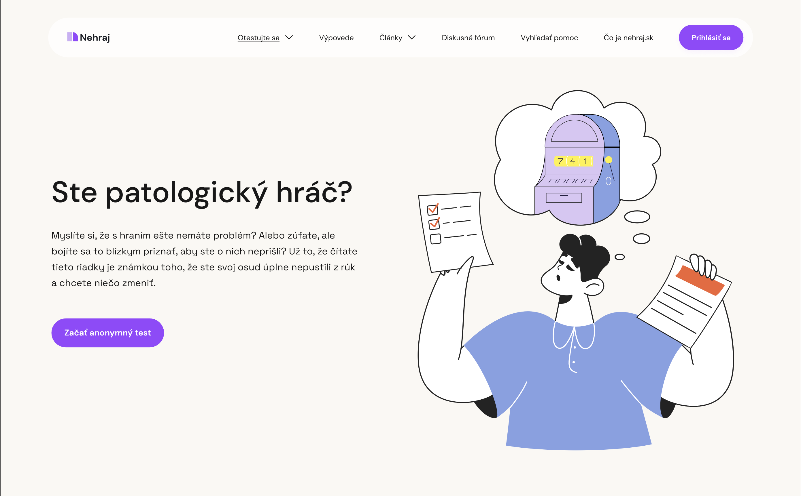

# Digital product to help pathological gamblers and their relatives

### Thesis Lightning Talk

by Klára Záskalanová

23 April 2024

- Listen to [the audio](assets/audio.mp3)
- Download [the slides](assets/surname-title-slides.pdf) // to be added <!-- Link to your slides: PDF, Figma, etc. -->
- Watch [the video](https://drive.google.com/file/d/1gVJ8_jA_0o9wxuVn5Cwqr1U_FtXxAIFz/view?usp=share_link) (audio + slides)

For my bachelor’s thesis I chose a topic of Web / App Design. But, I didn’t want to create a digital product from scratch, because I would have to come up with its purpose, with its content and basically with the whole idea.
 At that time, my father’s web portal needed upgrade to a new system, because of its ending web support. And he suggested, this would be a good time to redesign it too. This idea perfectly complied with my idea of the bachelor’s project and before I knew it, the assignment was ready.

The mentioned web is called nehraj.sk. (in English – don’t gamble) It is a web portal designed to help pathological gamblers and their relatives. Pathological gamblers are in other words people, who are addicted on different types of hazard games, such as slot machines, casino games or lotteries. Pathological gambling is one of the non-drug addictions and it concerns about 1 – 3 % of Slovak (the same for Czech) population.

This portal was created in year 2006 and there are still people whom it’s helping. The visual appearance, however, hasn’t changed since. Aside from that, you could find there a number of visual and sometimes even technical mistakes, what doesn’t help its overal impression. The text is often to small, which makes it uncomfortable for reading. Some pages don’t include the content they should and the navigation through the web is often confusing.

The first step was defining our goal of the thesis. That was — redesign this web in a way, that will be distinct from the websites dealing with gambling. The main requirements were to include more interactive elements and to create a strong visual that will spread the web’ s message.

The main competition is a website administered by gaming companies that have proceeded to self-regulation. Its main message is not to stop gambling, but just to gamble responsibly. This website has the strongest visuals, but it’s message is different.

The other websites whose message is the same, don’t dispose of a strong visual communication, which makes it a good opportunity to fill the gap.

The first part of our web that is supposed to catch user’s attention is homepage. Therefore I decided to set up our homepage on scrollytelling. Scrollytelling (which means scroll + storytelling) is when elements on a webpage appear, move, disappear, or otherwise change as the user scrolls the page. It is a method used to make web content more interactive and immersive.


The narrative at our homepage is based on stages of addiction. The hero section (which is the first screen you see at the homepage) consists of a simple sentence: Accept the loss. The arrow and the line navigates us to start scrolling and supports the user’s curiosity. Another method I used for amplifying the user’ lust for knowing more is a parallax effect. That means, that as you are scrolling, the objects in a scene are moving a different direction.


After ending the story, there is a question for a user, whether the story sounds familiar. And at the very end, there is a big letter call: *Accept your loss*. It’ll be the best win of your life. + call to action button saying Seek help. The big size of letters is supposed to slower the reading and give the reader a time to think deeper about what he / she has just read.

For the primary colour I chose a vivid purple, that refers to the casino aesthetics. In the combination with the primary background beige it should feel warm and it shouldn’t remind of medical websites. The initial primary colour was light blue, but after my thesis supervisor referred to it as sterile, I changed it to the purple. Supplementary colours used for illustrations are less saturated, to express we are moving away from the casino aesthetics. But I still kept a broad spectrum of colours, since our target audience is used to it.

A big part of the visual language are the illustrations. They are from an external resource icons8.com. Choosing the right illustrations wasn’t an easy task. The topic of gambling is pretty specific and not common. Therefore I had to find illustrations that are neutral enough to use them in this context. After their purchaser I had to edit the characters and create the scenes that would fit our story. Illustrations weren’t used only at the homepage, but throughout the whole web portal. Almost each of them had to be edited to match our topic.

Even though it isn’t such an important part, I created a new logo of the website. It is a connection of pause symbol (meaning you should pause and subsequently stop your gambling) and the page’s initial letter. It’s main purpose was to be suitable for the favicon format.

Except the homepage, there were another six pages to redesign. The first was a page where you can run a test, whether gambling concerns you or not. Or whether it concerns your relative.

The original version was a static list of questions, so I decided to make it more interactive, to engage the user.

Next  page is called Articles. Here I chose to use a filter in a form of tap-bar. You can chose whether you want articles for the gamblers, relatives, or a story for children.

Next page are Testimonies of people, who have an experience of gambling and treatment. You can choose, again by tap-bar filter, whether you want to read testimonies of gamblers or their relatives.

But there are also poems written by gamblers and their drawing. These were collected during group sessions at the psychiatric ward in Banská Bystrica (central Slovakia). This page is probably the strongest one.

Before I started designing this web portal, I ran a questionary between people currently undergoing  treatment. 11/19 of them responded, that while considering seeking the help, they were influenced by stories of others. Another finding was, that 17/19 respondents would be interested in discussion forum and 15 of them would be willing to register.

The redesign of discussion forum was the hardest part, and it would certainly need more time and attention. In terms of bachelor’s thesis, designing forum could be a thesis of its own. With my thesis supervisor, we considered not including it at all, but after the survey’s responses, I couldn’t afford that. I concluded with redesigning it, but there are still many thing that will need improvement.

Next page is Seek help. It consists of two subpages – Help for gamblers and Help for abused women and victims of violence. For these contacts I chose a form of cards that link to their websites. Contacts for victims of abuse can be filtered according to your county. I highlighted the crisis hotlines, since these are the most important information.

The last page comes the About us, but I renamed it to more personal name *What is nehraj.sk*. Here are the information that typically appear at About us pages. The most important are the closing words of the administrator and founder saying:

> I have been thinking about creating such a site for a long time. I wished that all the pain, suffering, but also hope and miraculous encounters would not remain only within the walls of the psychiatry in Banská Bystrica, but would go further. To help others, to show the way, to give courage and desire to fight for a better and more beautiful life…
 I thank to the people who decided to do something about their gambling problem and allowed me a glimpse into their lives. From them I drew inspiration, testimonies and the desire to pursue my goals in spite of the obstacles.

Additional part was my suggestion to ad a direct link to crisis line to homepage. And also a button, that a person can use when visiting a site with a lust for gambling. This button says: I feel like gambling and after pressing it, the user would be transferred to an article about resisting the temptation.

I also included a mobile interface demonstration.

Even though it probably won’t be used, I designed a promotion materials. The first are an online banner ads imitate the casino adverts and are a type of guerilla marketing. Another are Instagram and Facebook posts that include testimonies: I was willing to rob my wife. And snippets from the articles like: 5 steps how to avoid relaps or First aid card. The last idea for promotion are printed brochures promoting the web, placed in medical centres and ambulances.

During the thesis work a learned a lot mainly in UX design process. I had to use methods that were new to me, like content inventory and competition analysis of NGOs . But also those I already knew, like card sorting, sitemap, user flows and wire-framing. I also learned to stand a criticism and confirmed my passion for digital design. 
