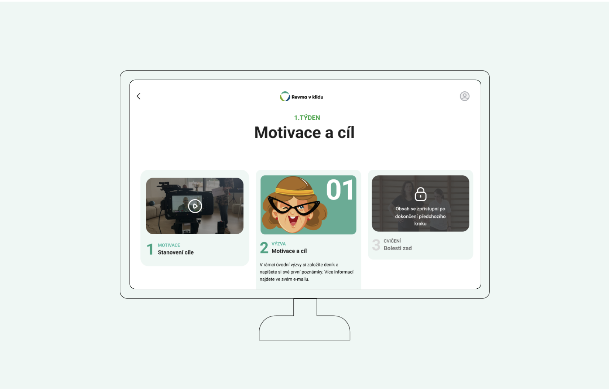

[About me](../about.md)
  [Home](../index.md)
  [Writing](../writing/index.md)

 
 # Projects

- [Rheumatic Diseases With Chill](#Rheumatic Diseases With Chill(Revma v Klidu))
  Online educational and motivational course for people with rheumatic diseases. It is being created by Czech.digital (Česko.digital), volunteer community of profesionals. I worked as a part of UX team together with developers, marketers, copywriters, graphic designer and the client themselves.

## Rheumatic Diseases With Chill (Revma v Klidu)
2023

The course is **one of its kind** in Czech Republic. It will spread awareness of the disease and motivate patients to physical exercise at home. It will help people, who can't afford exercising with professional assistance in a long-term.

In order to understand the needs and mainly the restrictions of our users we asked them about changes in their life after diagnoses. About treatment, about their relationship with physical exercise and about their digital literacy.

I gained the experience of **in-depth user interviews** and **user testing**, worked in a interdisciplinary team with another **13 people** and once again found my sense for the tiniest detail.

Project will be launched in January 2024, so stay tuned!
