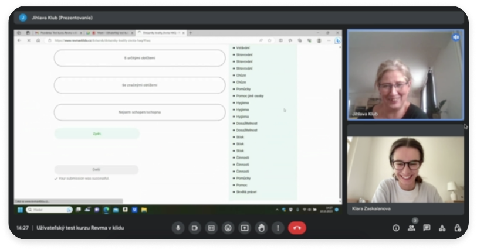

[About me](../about.md)
  [Home](../index.md)
  [Writing](../writing/index.md)

 
 # Projects

### Rheumatic Diseases With Chill (Revma v Klidu)
Online educational and motivational course for people with rheumatic diseases. It is being created by Czech.digital (Česko.digital), volunteer community of profesionals. I worked as a part of UX team together with developers, marketers, copywriters, graphic designer and the client themselves.

The course is **one of its kind** in Czech Republic. It will spread awareness of the disease and motivate patients to physical exercise at home. It will help people, who can't afford exercising with professional assistance in a long-term.

