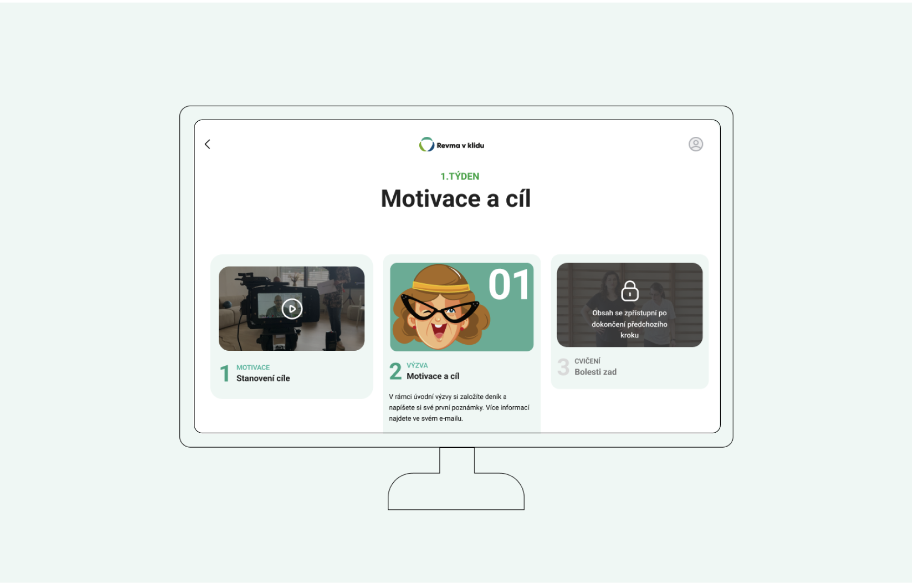
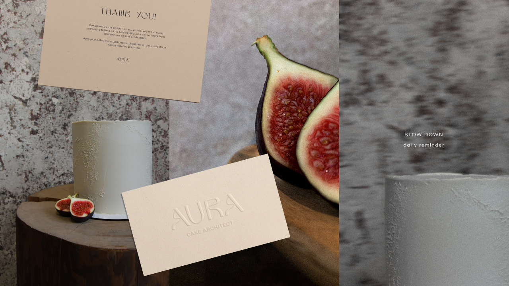
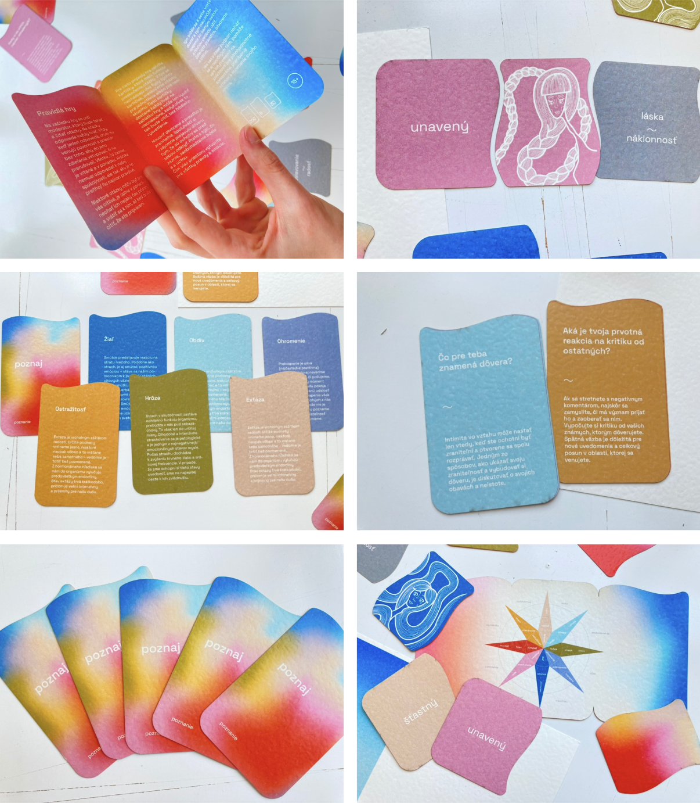

[About me](../about.md)
  [Home](../index.md)
  [Writing](../writing/index.md)

 
 # Projects

- [Rheumatic Diseases With Chill](#rheumatic-diseases-with-chil-(revma-v-klidu))
  
  Online educational and motivational course for people with rheumatic diseases. It is being created by Czech.digital (Česko.digital), volunteer community of profesionals. I worked as a part of UX team together with developers, marketers, copywriters, graphic designer and the client themselves.

- [Aura Cake Architect](#aura-cake-architect)

  Brand strategy with visual identitiy for patisserie. I came up with an idea, that Aura is not just about desserts. It is about slowing down. Stopping for a moment and fully enjoying it. Customers should focus on every taste and every texture on the tongue. This will help them to  enjoy not just the dessert, but the moment itself.

- [Recognition](#recognition-(poznanie))
  Communication board game Recognition educates in recognising basic emotions and naming our needs. Our team developed everything from the idea to the final prototype. The first (8+) level introduces world of emotions to children and the second (15+) level starts deeper and meaningul conversations in adults.

## Rheumatic Diseases With Chill (Revma v Klidu)
2023

The course is **one of its kind** in Czech Republic. It will spread awareness of the disease and motivate patients to physical exercise at home. It will help people, who can't afford exercising with professional assistance in a long-term.

In order to understand the needs and mainly the restrictions of our users we asked them about changes in their life after diagnoses. About treatment, about their relationship with physical exercise and about their digital literacy.

I gained the experience of **in-depth user interviews** and **user testing**, worked in a interdisciplinary team with another **13 people** and once again found my sense for the tiniest detail.

Project will be launched in January 2024, so stay tuned!

## Aura Cake Architect
2023

Aura is a small business, so the branding was all on me. I created it from scratch. Besides the visual identity, I came up with a list of potential names, I provided my client with a competition research, but I also took care of photos and copywriting.

The main idea I created is to be more present. Aura is not just about desserts. It is about slowing down. Stopping for a moment and fully enjoying it. Customers should focus on every taste and every texture on the tongue. This will help them to  enjoy not just the dessert, but the moment itself.

Clients review:
> Klára totally exceeded my expectations. It was obvious the work interests her and that she enjoys it. She fully understood what my idea was. She did a lot of things extra, she was patient,  always consulted everything with me and last but not least, she has a strong sense for a detail.

## Recognition (Poznanie)
2023

As a reference, we used existing tool commonly used in psychology practice. Via this tool, children are learning to notice and name their emotions. Psychologist talks with a child about various situations that has happened. Together they find out what the child felt in that situation.

### 8+

Realising our feelings and naming them is the first step. Child picks a card with an illustration of feeling that had experienced and looks for a name of it, or the other way round. The second step, is realisation of needs and naming them. Child is given another set of cards. These help to find words for expressing. what, in reaction to certain emotion, would he/she need. This level is aimed for parents, teachers and school psychologists. Naming our emotions and needs isn’t easy, therefore these cards are suitable for adults, as well.

### 15+

Second level of game is aimed for adults. The goal is to start a conversation about deeper and sensitive topics. This level is based on questions focused on emotional life. Each question is coupled with an affirmation, quote or a story connected to the regarding emotion, which is supposed to help and enrich the player/s.

### Design

The main design element, that can be seen in each card and also on the box is a **wave (of emotions)**. The gradient on the box represents our emotions when they are mixed together in ourselves and we are confused by them. And the cards inside the box, always consisting of one color, symbolise your emotions after the game. They are distinguished and separated.
